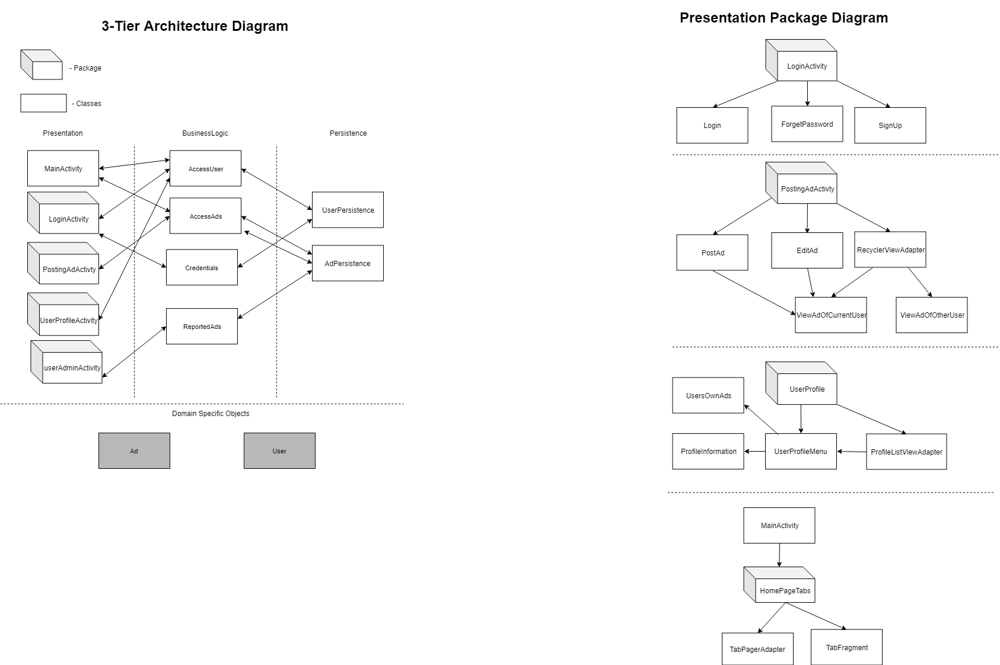

#   Architecture
The architecture for SimpliSell is 3-tier architecture, consisting of the presentation, logic and the persistence layer.

##  Presentation Layer
*   Includes the user interface
*   Purpose of the interface is to translate tasks and results to something the user can understand

**MainActivity**
*   Includes the homepage UI which views all the Ads and has a post Ad button and a profile Button for easy navgation for the user.

**SpashActivity**
*   When the app starts the splash screen stays for about 2 seconds.

**UserProfile**

*   UsersOwnAds
*   ProfileInformation
*   UserProfileMenu
*   ProfileListViewAdapter
*   

**UserAdminActivity**
*   ReportedAds

**HomePageTabs**

*   TabFragment
*   TabFragmentAdapter

**Login**
*   Responsible for User Login and gives the user the option to reset his/her password in case of forgotten password.

**SignUp**
*   Sign Up helps the user create a new account so that they can post Ads. 

**EditAd**
*   Allows user to edit his/her own ad.

**PostAd**
*   Allows user to post an Ad.

##  Business Layer
*   Coordinates our application, processes commands, and makes logical decisions and evaluations, and performs calculations.
*   Also moves and processes data between TWO surrounding layers

**AccessAds**

*   Insert, get and delete advertisements from the database and Filters out advertisements based on categories, and sorts the advertisements by price

**AccessUsers**

*   Insert, and get users from the database

**UserCredentials**

*   Authenticate users.
 
**ValidPasswordChecker**

*   Validates if password meets the required standard

##  Persistence Layer
*   Information is stored and retrived from a database or file system
*   The information is passed back to the logic tier for processing, and then eventually back to the user

**AdPersistence**

*   Interface for advertisements in the database

**UserPersistence**

*   Interface for users in the database

**AdPersistenceStub**

*   Stub implementation for advertisements in the database

**UserPersistenceStub**

*   Stub implementation for users in the database
 
**AdPersistenceHSQLDB**

*   Implementation for advertisements in the database

**UserPersistenceHSQLDB**

*   Implementation for users in the database
 

##   Domain Objects
**Ad**

*   The object for advertisements posted by a user.

**User**

*   The object for users